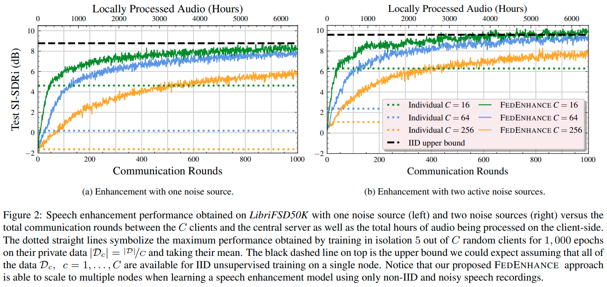
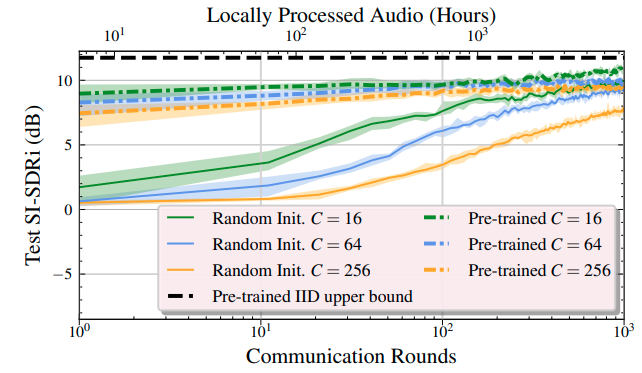
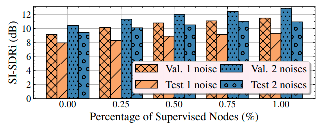

# Separate but Together: Unsupervised Federated Learning for Speech Enhancement from Non-IID Data

TLDR; The main contribution of this paper is to develop a federated learning (FL) system which is capable of learning a sound separation model when noisy speech recordings are distributed in a non-IID fashion across multiple clients. The overall system works without relying on several common assumptions such as: a) clients having access to supervised data and b) assuming IID distribution of the data across the clients.

Specifically, we make the following contributions:

1. We provide the first completely unsupervised system which is capable to be trained in a federated learning fashion for speech enhancement.
2. We show that we can expedite the convergence and boost the overall performance of our FL method by transferring knowledge from another medium-size speech enhancement dataset like WHAM [[1]](#1).
3. We can effectively combine updates from clients with supervised and unsupervised data using different loss functions.
4. We provide the recipes for the creation of a benchmark dataset (based on LibriSpeech [[2]](#1) and FSD50K [[3]](#1)), namely, LibriFSD50K in order to measure our performance.

FedEnhance uses mixture invariant training (MixIT) [[4]](#1) to perform the local unsupervised updates on each client's limited data. In order to make the overall setup realistic, we assume that the clients could also contribute with their mobile devices and thus, we use a very efficient variation of the Sudo -rm rf models[[5]](#1) which enable high fidelity sound recosntruction with minimal computational requirements in terms of time and memory. All clients perform local unsupervised training using MixIT by synthesizing a mixture from a noisy speech recording and a noise recording. The server is going to aggregate the weight updates coming from the clients in order produce the updated model. The new model is going to be distributed again across all clients and the process is repeated for multiple communication rounds 

## Table of contents

- [Fedenhance results](#fedenhance-results)
- [LibriFSD50K Dataset Generation](#librifsd50k-dataset-generation)
- [How to run](#how-to-run)
- [References](#references)
- [Copyright and license](#copyright-and-license)


## Fedenhance results

### Unsupervised federated speech enhancement



### Transfer learning from pre-trained model on WHAM


Convergence of FedEnhance on LibriFSD50K test set with two active noise sources when starting from the pre-trained model (dotted) and when starting from a random initialization (solid). For better visualization, we plot the mean across 10 communication rounds in log scale while the shaded regions are defined by the minimum and maximum SI-SDRi obtained in the same number of rounds. The black dashed line on top is the upper bound obtained with IID unsupervised training on a single node starting from the same pre-trained model.

### Combining supervised and unsupervised federated nodes


Speech enhancement performance on LibriFSD50K validation and test sets with one or two active noise sources while sweeping the number of supervised nodes from totally unsupervised FL (left) to totally supervised FL (right).

## LibriFSD50K Dataset Generation

To make the LibriFSD50k dataset:
1. Download and organize all the data.
```shell
cd fedenhance/dataset_maker
./get_libri.sh <download_dir>
```
2. Generate the libriFSD50k dataset using the downloaded data.
```shell
python make_librifsd50k.py --download_dir <download_dir> --out_dir <librifsd50k_output_dir>
```

To make the WHAM pretraining dataset:
1. Download and generate WHAM. This assumes you already have a copy of the WSJ dataset.
```shell
get_wham.sh <dir_of /wsj0-mix/wsj> <wham_output_dir>
```
2. Generate federated WHAM.
```shell
python make_fed_wham.py --wham_dir <wham_output_dir/wav16k/max> --out_dir <fedwham_output_dir>
```

## How to run

1. Setup your cometml credentials and paths for datasets in the config file.
```shell
vim ./fedenhance/__config__.py
```

2. Set the environment variable.
```shell
export PYTHONPATH=/your_directory_path/fedenhance/:$PYTHONPATH
```

3. Run a federated learning experiment while training from scratch 256 unsupervised clients. In each communication round only 25 % of them are going to contribute to the updates. The maximum number of sources needs to be 3 since we want to separate one clean speech from two noise sources.

```shell
cd fedenhance/experiments
python run_federated.py \
--n_global_epochs 50000 --model_type sudo_groupcomm_v2 \
--enc_kernel_size 41 --out_channels 256 --enc_num_basis 512 --in_channels 512 --num_blocks 8 \
--learning_rate 0.001 -bs 6 --divide_lr_by 2. --patience 0 --clip_grad_norm 5. --optimizer adam -cad 0 \
--audio_timelength 4. --max_num_sources 3 --project_name fedenhance -tags unsupervised_fedenhance_rocks --cometml_log_audio \
--n_fed_nodes 256 --p_supervised 0.0 --available_speech_percentage 0.5 --p_single_mix 0.0 --p_available_users 0.25
```

4. Run transfer learning experiments.

First pre-train for a few epochs on WHAM.
```shell
cd fedenhance/experiments
python run_pretraining.py \
--n_global_epochs 50000 --model_type sudo_groupcomm_v2 \
--enc_kernel_size 41 --out_channels 256 --enc_num_basis 512 --in_channels 512 --num_blocks 8 \
--learning_rate 0.001 -bs 6 --divide_lr_by 2. --patience 0 --clip_grad_norm 5. --optimizer adam -cad 0 \
--audio_timelength 4. --max_num_sources 3 --project_name fedenhance -tags a_pretrained_model --cometml_log_audio \
--p_supervised 1.0 --available_speech_percentage 0.5 --p_single_mix 0.0
```

Then finetune on LibriFSD50K with 64 clients assuming that the WHAM pre-trained model has been trained for 100 epochs. We also reduce the learning rate on the local training setups to 0.0001.
```shell
cd fedenhance/experiments
python run_federated.py \
--n_global_epochs 50000 --model_type sudo_groupcomm_v2 \
--enc_kernel_size 41 --out_channels 256 --enc_num_basis 512 --in_channels 512 --num_blocks 8 \
--learning_rate 0.0001 -bs 6 --divide_lr_by 2. --patience 0 --clip_grad_norm 5. --optimizer adam -cad 0 \
--audio_timelength 4. --max_num_sources 3 --project_name fedenhance -tags a_pretrained_model --cometml_log_audio \
--n_fed_nodes 256 --p_supervised 0.0 --available_speech_percentage 0.5 --p_single_mix 0.0 --p_available_users 0.25 \
--warmup_checkpoint=/home/thymios/fedenhance_log/a_pretrained_model/model_epoch_100
```

You can easily simulate conditions where some of the nodes have supervised data by simply changing 
```shell
--p_supervised 0.0
```

The parameter _available_speech_percentage_ controls the number of available speech utterances wrt the 1:1 mapping needed with the noisy recordings from FSD50k.  
```shell
--available_speech_percentage 0.5
```

5. In order to see the difference when training with individual nodes on LibriFSD50K. Here we select 5 random client ids 0, 1, 2, -1 and -2.

```shell
cd fedenhance/experiments
python run_individual.py \
--n_global_epochs 50000 --model_type sudo_groupcomm_v2 \
--enc_kernel_size 41 --out_channels 256 --enc_num_basis 512 --in_channels 512 --num_blocks 8 \
--learning_rate 0.001 -bs 6 --divide_lr_by 2. --patience 0 --clip_grad_norm 5. --optimizer adam -cad 0 \
--audio_timelength 4. --max_num_sources 3 --project_name fedenhance -tags unsupervised_fedenhance_rocks --cometml_log_audio \
--n_fed_nodes 256 --p_supervised 0.0 --available_speech_percentage 0.5 --p_single_mix 0.0 --p_available_users 0.25 --selected_node_ids 0 1 2 -1 -2
```

## References
<a id="1">[1]</a> G. Wichern, J. Antognini, M. Flynn, L. R. Zhu, E. McQuinn, D. Crow, E. Manilow, and J. L. Roux, “WHAM!: Extending Speech Separation to Noisy Environments,” in Proc. Interspeech, 2019, pp. 1368–1372.

<a id="1">[2]</a> V. Panayotov, G. Chen, D. Povey, and S. Khudanpur, “Librispeech: an asr corpus based on public domain audio books,” in Proc. ICASSP, 2015, pp. 5206–5210.

<a id="1">[3]</a> E. Fonseca, X. Favory, J. Pons, F. Font, and X. Serra, “Fsd50k: an open dataset of human-labeled sound events,” arXiv preprint arXiv:2010.00475, 2020.

<a id="1">[4]</a> S. Wisdom, E. Tzinis, H. Erdogan, R. Weiss, K. Wilson, and J. Hershey, “Unsupervised sound separation using mixture invariant training,” in Advances in Neural Information Processing Systems, vol. 33, 2020.

<a id="1">[5]</a> E. Tzinis, Z. Wang, and P. Smaragdis, “Sudo rm-rf: Efficient networks for universal audio source separation,” in Proc. MLSP, 2020, pp. 1–6.


## Copyright and license
University of Illinois Open Source License

Copyright © 2021, University of Illinois at Urbana Champaign. All rights reserved.

Developed by: Efthymios Tzinis 1, Jonah Casebeer 1, Zhepei Wang 1 and Paris Smaragdis 1,2

1: University of Illinois at Urbana-Champaign 

2: Adobe Research 

Permission is hereby granted, free of charge, to any person obtaining a copy of this software and associated documentation files (the “Software”), to deal with the Software without restriction, including without limitation the rights to use, copy, modify, merge, publish, distribute, sublicense, and/or sell copies of the Software, and to permit persons to whom the Software is furnished to do so, subject to the following conditions: Redistributions of source code must retain the above copyright notice, this list of conditions and the following disclaimers. Redistributions in binary form must reproduce the above copyright notice, this list of conditions and the following disclaimers in the documentation and/or other materials provided with the distribution. Neither the names of Computational Audio Group, University of Illinois at Urbana-Champaign, nor the names of its contributors may be used to endorse or promote products derived from this Software without specific prior written permission. THE SOFTWARE IS PROVIDED “AS IS”, WITHOUT WARRANTY OF ANY KIND, EXPRESS OR IMPLIED, INCLUDING BUT NOT LIMITED TO THE WARRANTIES OF MERCHANTABILITY, FITNESS FOR A PARTICULAR PURPOSE AND NONINFRINGEMENT. IN NO EVENT SHALL THE CONTRIBUTORS OR COPYRIGHT HOLDERS BE LIABLE FOR ANY CLAIM, DAMAGES OR OTHER LIABILITY, WHETHER IN AN ACTION OF CONTRACT, TORT OR OTHERWISE, ARISING FROM, OUT OF OR IN CONNECTION WITH THE SOFTWARE OR THE USE OR OTHER DEALINGS WITH THE SOFTWARE.
